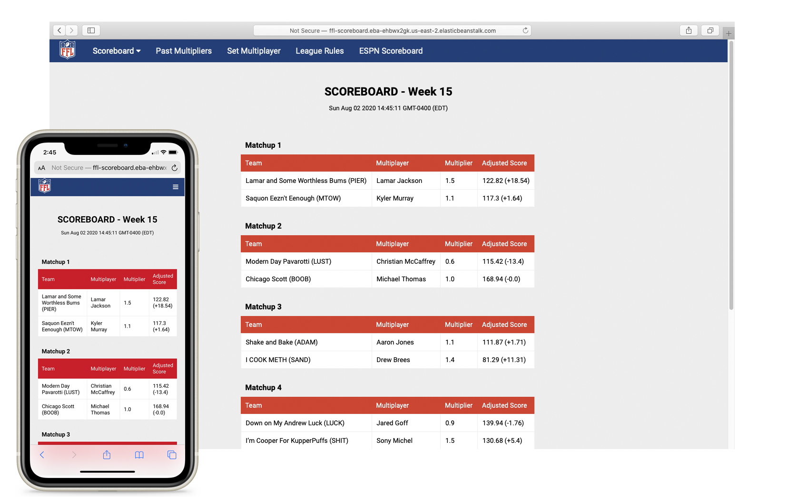

# FF_scoreboard
Custom scoreboard view for ESPN fantasy football league.
Built utilizing Flask and deployed with AWS.



## Getting Started
**Running the Scoreboard Locally**
```
python -m venv ff-venv
source ff-venv/bin/activate
pip install -r requirements.txt
source FLASK_APP=application.py
flask run
```

## AWS Services Required
- Elastic Beanstalk (EC2, S3, etc.)
- DynamoDB
- Cognito

**Initializing DynamoDB Tables w/ Existing Values**
```
python setup/dynamodb_create_multipliers.py
python setup/dynamodb_create_teams.py
python setup/dynamodb_create_table.py
```

**Deploying with Elastic Beanstalk**
```
eb init
eb create ffl-scoreboard
```
https://docs.aws.amazon.com/elasticbeanstalk/latest/dg/create-deploy-python-flask.html

## Helpful References
- ESPN Fantasy Football API: https://stmorse.github.io/journal/espn-fantasy-3-python.html
- Translating Cognito Tokens: https://github.com/cgauge/Flask-AWSCognito/tree/6882a0c246dcc8da8e299c1e8b468ef5899bc373

## File Structure
```
├── README.md
├── application.py
├── colors.py
├── config.py
├── espn.py
├── forms.py
├── helpers.py
├── requirements.txt
├── setup
│   ├── dynamodb_create_multipliers.py
│   ├── dynamodb_create_table.py
│   ├── dynamodb_create_teams.py
│   ├── multiplayer_table_sample_data.csv
│   └── multipliers.csv
├── static
│   ├── FFL-square-outline.png
│   ├── FFL-square.png
│   └── styles
│       └── base.css
└── templates
    ├── base.html
    ├── input_form.html
    ├── multiplier_results.html
    ├── multipliers.html
    ├── scoreboard.html
    ├── submission_fail.html
    ├── submission_success.html
    └── temp_redirect.html
```
